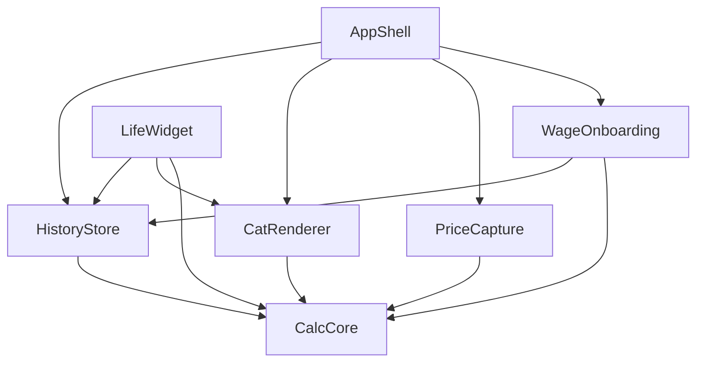

# LifeMeter iOS App

[](https://github.com/lifemeter/lifemeter-ios/actions)
[](https://codecov.io/gh/lifemeter/lifemeter-ios)
[](https://swift.org)
[](https://developer.apple.com/ios/)
[](https://opensource.org/licenses/MIT)

A privacy-first micro-utility that shows people how many minutes of life they trade for anything they buy. Convert any price into the time you work to afford it, featuring delightful pixel-cat animations and seamless widget integration.

## 🌟 Features

### Core Functionality
- **Instant Price Conversion**: Enter your hourly wage once, then convert any price to work time
- **OCR Price Scanning**: Scan receipts and photos to extract prices automatically using VisionKit
- **Multi-Currency Support**: Supports EUR, USD, GBP, JPY, CHF, CAD, and AUD with automatic formatting
- **Secure Wage Storage**: Wages stored securely in iOS Keychain with `.accessibleAfterFirstUnlock` protection

### Delightful Experience
- **Pixel-Cat Animations**: Four animated states (sleep, walk, run, pounce) based on work time required
- **Thank You Modal**: Shows exactly how long you worked to pay for the app (€2.99) after first wage entry
- **Glass-morphism UI**: Modern iOS design with subtle depth and material backgrounds
- **Haptic Feedback**: Tactile responses for key interactions

### Widget Integration
- **Home Screen Widgets**: Small and medium widgets with interactive price steppers
- **Lock Screen Widgets**: Quick access via AccessoryInline, AccessoryCircular, and AccessoryRectangular
- **Live Updates**: Widgets refresh automatically and show real-time cat animations

### Privacy & Security
- **No Analytics**: Zero data collection or external network calls
- **Local Storage**: All data stored locally with optional iCloud sync
- **Open Source**: Full transparency with publicly available source code

## 📱 Screenshots

| Onboarding | Main App | Price Capture | Widget |
|------------|----------|---------------|--------|
|  |  |  |  |

## 🏗️ Architecture

LifeMeter follows a modular architecture using Swift Package Manager with clear separation of concerns:

```
LifeMeter/
├── Modules/
│   ├── CalcCore/           # Core conversion logic and utilities
│   ├── HistoryStore/       # CoreData + CloudKit persistence layer
│   ├── WageOnboarding/     # Initial setup and thank-you flow
│   ├── PriceCapture/       # Manual input and OCR functionality
│   ├── CatRenderer/        # Pixel-cat animation engine
│   ├── LifeWidget/         # WidgetKit implementation
│   └── AppShell/           # Main app navigation and UI
├── Assets/                 # Icons, sprites, and screenshots
├── Tests/                  # Unit, UI, and integration tests
├── Fastlane/              # Deployment automation
├── CI/                    # GitHub Actions workflows
├── Docs/                  # Architecture and API documentation
└── Legal/                 # Privacy policy and compliance
```

### Module Dependencies



## 🚀 Getting Started

### Prerequisites

- **Xcode 15.4+** with iOS 17.5 SDK
- **macOS 14.5+** (Sonoma or later)
- **Swift 5.10+**
- **iOS 15.0+** deployment target

### Installation

1. **Clone the repository**
   ```bash
   git clone https://github.com/lifemeter/lifemeter-ios.git
   cd lifemeter-ios
   ```

2. **Install dependencies**
   ```bash
   swift package resolve
   ```

3. **Open in Xcode**
   ```bash
   open LifeMeter.xcworkspace
   ```

4. **Build and run**
   - Select the LifeMeter scheme
   - Choose your target device or simulator
   - Press ⌘+R to build and run

### Development Setup

1. **Install Fastlane**
   ```bash
   sudo gem install fastlane
   ```

2. **Setup development certificates**
   ```bash
   fastlane setup
   ```

3. **Run tests**
   ```bash
   fastlane test
   ```

4. **Code quality checks**
   ```bash
   fastlane quality
   ```

## 🧪 Testing

LifeMeter maintains high test coverage with comprehensive test suites:

### Test Coverage Requirements
- **Unit Tests**: ≥90% coverage
- **UI Tests**: ≥70% coverage
- **Integration Tests**: Critical user flows

### Running Tests

```bash
# All tests
fastlane test

# Unit tests only
fastlane unit_tests

# UI tests only
fastlane ui_tests

# Widget tests
fastlane widget_tests

# Performance tests
fastlane performance_tests
```

### Test Structure

```
Tests/
├── Unit/
│   ├── CalcCoreTests/          # Conversion logic tests
│   ├── CurrencyUtilitiesTests/ # Price parsing and formatting
│   ├── HistoryStoreTests/      # Data persistence tests
│   └── KeychainManagerTests/   # Secure storage tests
├── UI/
│   ├── WageOnboardingUITests/  # Onboarding flow tests
│   ├── PriceCaptureUITests/    # OCR and input tests
│   └── MainAppUITests/         # Core app functionality
└── Integration/
    ├── WidgetIntegrationTests/ # Widget data sharing
    └── CloudKitSyncTests/      # iCloud synchronization
```

## 🔧 Configuration

### Build Configurations

- **Debug**: Development builds with full logging
- **Release**: Optimized production builds
- **Testing**: Special configuration for automated testing

### Environment Variables

```bash
# Required for CI/CD
FASTLANE_USER=your-apple-id@example.com
FASTLANE_PASSWORD=your-app-specific-password
MATCH_PASSWORD=your-match-password
GITHUB_TOKEN=your-github-token

# Optional
SLACK_URL=your-slack-webhook-url
CODECOV_TOKEN=your-codecov-token
```

### App Configuration

Key settings can be configured in `Config.swift`:

```swift
struct AppConfig {
    static let appCostEUR: Double = 2.99
    static let supportedCurrencies = ["EUR", "USD", "GBP", "JPY", "CHF", "CAD", "AUD"]
    static let defaultCurrency = "EUR"
    static let widgetRefreshInterval: TimeInterval = 900 // 15 minutes
}
```

## 📦 Deployment

### TestFlight Deployment

```bash
# Deploy to TestFlight
fastlane beta
```

### App Store Release

```bash
# Full App Store release
fastlane release
```

### Manual Build

```bash
# Development build
fastlane build_dev

# App Store build
fastlane build_appstore
```

## 🎨 Design System

### Color Palette

- **Primary Blue**: `#007AFF` - Main accent color
- **Secondary Purple**: `#5856D6` - Gradient accents
- **Success Green**: `#34C759` - Positive actions
- **Warning Red**: `#FF3B30` - Destructive actions
- **Background**: `.regularMaterial` - Glass-morphism effect

### Typography

- **Headlines**: SF Pro Display, Bold
- **Body Text**: SF Pro Text, Regular
- **Numbers**: SF Pro Rounded, Medium
- **Pixel Font**: Custom pixel font for cat-related text

### Cat Animation States

| State | Threshold | Frame Rate | Description |
|-------|-----------|------------|-------------|
| Sleep | ≥120 min | 2 fps | Cat curled up, eyes shut |
| Walk | 30-119 min | 4 fps | Cat strolling |
| Run | 5-29 min | 6 fps | Cat trotting fast |
| Pounce | <5 min | 8 fps | Cat jumping & meowing |

## 🔒 Privacy & Security

### Data Collection
LifeMeter follows a strict "Data Not Collected" policy:
- No analytics or tracking
- No external network calls
- No user identification
- No behavioral data collection

### Data Storage
- **Wages**: Stored in iOS Keychain with `.accessibleAfterFirstUnlock`
- **Calculations**: Local CoreData with optional iCloud sync
- **Settings**: UserDefaults for non-sensitive preferences

### Security Measures
- Input validation and sanitization
- Secure coding practices
- Regular security audits
- No hardcoded secrets or API keys

## 🌍 Localization

Currently supported languages:
- **English** (en)
- **German** (de)

### Adding New Languages

1. Add language to `Localizable.strings`
2. Update OCR language support in `PriceCapture`
3. Add currency formatting for locale
4. Update App Store metadata

## 🤝 Contributing

We welcome contributions! Please see our [Contributing Guidelines](CONTRIBUTING.md) for details.

### Development Workflow

1. Fork the repository
2. Create a feature branch (`git checkout -b feature/amazing-feature`)
3. Make your changes
4. Add tests for new functionality
5. Ensure all tests pass (`fastlane test`)
6. Run quality checks (`fastlane quality`)
7. Commit your changes (`git commit -m 'Add amazing feature'`)
8. Push to the branch (`git push origin feature/amazing-feature`)
9. Open a Pull Request

### Code Style

- Follow Swift API Design Guidelines
- Use SwiftLint for consistent formatting
- Write comprehensive tests for new features
- Document public APIs with Swift DocC

## 📄 License

This project is licensed under the MIT License - see the [LICENSE](LICENSE) file for details.

## 🙏 Acknowledgments

- **Apple** for iOS development frameworks
- **Swift Community** for open-source packages
- **Pixel Art Community** for cat sprite inspiration
- **Privacy Advocates** for guidance on data protection

## 📞 Support

- **Email**: support@lifemeter.app
- **GitHub Issues**: [Report a bug](https://github.com/lifemeter/lifemeter-ios/issues)
- **App Store**: [Leave a review](https://apps.apple.com/app/lifemeter/id123456789)

## 🗺️ Roadmap

### v1.1 (Q3 2025)
- watchOS companion app
- StandBy mode widget
- Additional currencies

### v1.2 (Q4 2025)
- macOS Catalyst port
- Siri Shortcuts integration
- Advanced analytics (privacy-preserving)

### v2.0 (2026)
- AI-powered expense categorization
- Social sharing features
- Premium subscription tier

---

**Made with ❤️ by the LifeMeter Team**

*Converting prices to time, one calculation at a time.*


## 🍎 Apple Pay Automation (iOS 17+)

LifeMeter now features automatic Apple Pay transaction logging using iOS 17+ Shortcuts integration. When you pay with Apple Pay at terminals, LifeMeter automatically calculates and displays the work time required for your purchase.

### How It Works

1. **Automatic Detection**: iOS 17+ exposes Apple Pay transactions through Shortcuts triggers
2. **Instant Calculation**: LifeMeter receives the transaction data and calculates work time
3. **Smart Notification**: You get a notification like "€4.50 coffee • 9m 12s" immediately after paying
4. **History Logging**: Transactions are automatically saved to your LifeMeter history

### Setup Process

#### Initial Configuration
1. Open LifeMeter and complete wage onboarding
2. After entering your wage, you'll see "Set up Apple Pay automation?"
3. Tap "Add Now" to open the Shortcuts app with a pre-configured automation
4. Accept the automation and ensure "Ask Before Running" is **OFF**
5. Tap "Done" to activate

#### Manual Setup
1. Open LifeMeter → Settings → Apple Pay
2. Tap "Add Automation"
3. Follow the Shortcuts app prompts
4. Disable "Ask Before Running" for seamless operation

### Supported Transactions

| Transaction Type | Support Status | Notes |
|------------------|----------------|-------|
| **NFC Tap-to-Pay** | ✅ Fully Supported | Works at all contactless terminals |
| **Apple Watch Payments** | ⏳ Coming Soon | Planned for future iOS updates |
| **In-App Purchases** | ❌ Not Available | iOS limitation - not reported to Shortcuts |
| **App Store Purchases** | ❌ Not Available | iOS limitation - not reported to Shortcuts |

### Privacy & Security

- **Local Processing**: All transaction data is processed locally on your device
- **No External Servers**: LifeMeter never sends transaction data to external services
- **Shortcuts Integration**: Uses Apple's official Shortcuts framework
- **No Card Numbers**: Only receives amount, currency, and merchant name
- **User Control**: You can disable automation at any time

### Technical Implementation

#### TransactionLogger Module
```swift
@available(iOS 17.0, *)
public class TransactionLogger: ObservableObject {
    public static let shared = TransactionLogger()
    
    @MainActor
    public func handle(_ transaction: Transaction) async throws {
        // Calculate work time using existing CalcCore
        // Save to HistoryStore with source = .applePay
        // Post local notification with custom actions
    }
}
```

#### App Intent Integration
```swift
@available(iOS 17.0, *)
public struct LogTransactionIntent: AppIntent {
    static var title: LocalizedStringResource = "Log Apple Pay Transaction"
    
    @Parameter(title: "Transaction Amount") var amount: Double
    @Parameter(title: "Currency Code") var currency: String
    @Parameter(title: "Merchant Name") var merchant: String?
    
    @MainActor
    public func perform() async throws -> some IntentResult {
        // Process transaction through TransactionLogger
    }
}
```

#### Shortcut Template
The app provides a pre-configured Shortcuts automation that:
1. Triggers on Apple Pay transactions
2. Extracts amount, currency, and merchant data
3. Calls LifeMeter's App Intent
4. Runs silently in the background

### Notification Features

#### Smart Notifications
- **Format**: "€4.50 coffee • 9m 12s"
- **Custom Sound**: Subtle confirmation tone
- **Actions**: Undo (removes transaction) and Open (view details)
- **Deep Linking**: Taps open the specific transaction in LifeMeter

#### Notification Categories
```swift
let category = UNNotificationCategory(
    identifier: "APPLE_PAY_MINUTES",
    actions: [undoAction, openAction],
    intentIdentifiers: [],
    options: [.customDismissAction]
)
```

### UI Integration

#### Enhanced Onboarding
- Step 2/2 after wage entry: "Set up Apple Pay automation?"
- Visual guide showing the automation flow
- One-tap setup with pre-configured Shortcuts

#### Settings Integration
- **Settings → Apple Pay**: Dedicated automation management
- **Toggle Status**: Shows if automation is active
- **Recent Transactions**: Quick view of Apple Pay purchases
- **Information Panel**: Explains supported transaction types

#### History Filtering
- **Apple Pay Filter**: New pill in transaction history
- **Source Indicators**: Icons showing manual, OCR, or Apple Pay entry
- **Merchant Names**: Displayed when available from transaction data

### Testing & Quality Assurance

#### Unit Tests
- **Transaction Processing**: Validates calculation accuracy
- **Error Handling**: Tests edge cases and error conditions
- **Notification Formatting**: Ensures correct display text
- **Currency Support**: Tests all supported currencies

#### UI Tests
```swift
func testApplePayAutomation_SetupFlow_CompletesSuccessfully() {
    // Test the complete setup flow from onboarding to Shortcuts
}

func testApplePayNotification_TapActions_NavigateCorrectly() {
    // Test notification action handling
}
```

#### Integration Tests
- **Shortcuts Validation**: Ensures exported shortcuts are valid
- **App Intent Testing**: Validates intent parameter handling
- **Notification Actions**: Tests undo and open functionality

### Performance Considerations

#### Memory Usage
- **Lightweight Processing**: Minimal overhead for transaction handling
- **Efficient Notifications**: Optimized notification content and actions
- **Background Processing**: Designed for quick execution and exit

#### Battery Impact
- **Passive Listening**: No active monitoring or polling
- **Event-Driven**: Only activates when transactions occur
- **Optimized Calculations**: Reuses existing CalcCore algorithms

### Troubleshooting

#### Common Issues

**Automation Not Triggering**
1. Verify iOS 17+ is installed
2. Check that "Ask Before Running" is disabled in Shortcuts
3. Ensure LifeMeter has notification permissions
4. Restart the Shortcuts app if needed

**Missing Notifications**
1. Check notification permissions for LifeMeter
2. Verify Do Not Disturb settings
3. Ensure the automation is enabled in Shortcuts
4. Test with a small Apple Pay transaction

**Incorrect Calculations**
1. Verify wage is correctly set in LifeMeter
2. Check currency settings match your region
3. Ensure the latest app version is installed

#### Debug Information
- **Settings → Apple Pay → Information**: Shows automation status
- **Transaction History**: Displays source for each calculation
- **Notification Log**: Available in iOS Settings → Notifications

### Future Enhancements

#### Planned Features (v1.1)
- **Apple Watch Support**: When iOS exposes Watch transaction triggers
- **Enhanced Merchant Data**: Richer transaction details when available
- **Spending Categories**: Automatic categorization of Apple Pay purchases
- **Weekly Summaries**: Aggregated Apple Pay spending reports

#### Potential Integrations
- **Siri Shortcuts**: Voice commands for manual transaction logging
- **Control Center**: Quick access to recent Apple Pay transactions
- **StandBy Mode**: Apple Pay transaction widgets for iOS 17+

### Developer Notes

#### App Intent Registration
Add to Info.plist:
```xml
<key>NSUserActivityTypes</key>
<array>
    <string>LogTransactionIntent</string>
</array>
```

#### Shortcuts Export
The app bundles a `.shortcut` file that can be imported via:
```swift
let importURL = URL(string: "shortcuts://import-shortcut?name=LifeMeter%20Apple%20Pay%20Logger")
UIApplication.shared.open(importURL)
```

#### Privacy Manifest Updates
```xml
<key>NSPrivacyCollectedDataTypes</key>
<array>
    <!-- Still no data collected - Apple Pay data processed locally -->
</array>
```

---

**Automatic Apple Pay Logging Quick Start:**
1. Open LifeMeter → Settings → Apple Pay
2. Tap "Add Automation" → Accept in Shortcuts → Disable "Ask Before Running"
3. Pay with Apple Pay next time → LifeMeter whispers the minutes you just spent

